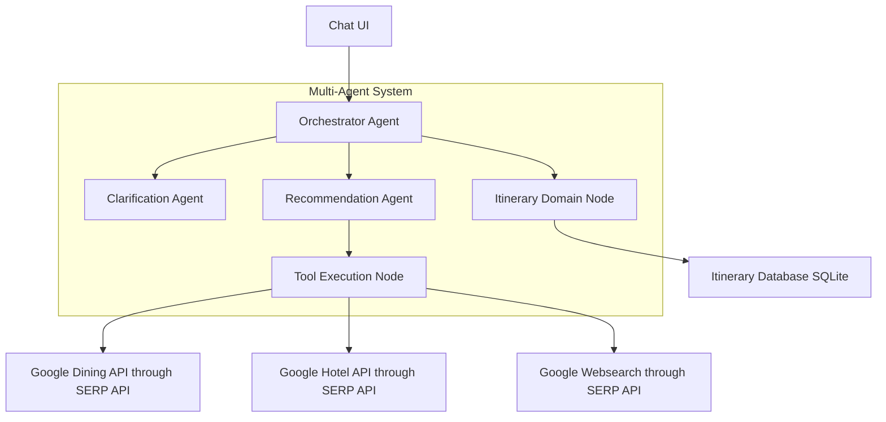

# Smart Travel Planner

```mermaid 
graph TD
    CHAT[Chat UI]
    ORCH_AGENT[Orchestrator Agent]
    CLARIFY_AGENT[Clarification Agent]
    RECOMMEND_AGENT[Recommendation Agent]
    TOOL_NODE[Tool Execution Node]
    GOOGLE_DINING[Google Dining API through SERP API]
    GOOGLE_HOTEL[Google Hotel API through SERP API]
    GOOGLE_ACTIVITIES[Google Websearch through SERP API]
    ITINERARY_DB[Itinerary Database SQLite]

    subgraph Multi-Agent System
        ORCH_AGENT[Orchestrator Agent]
        CLARIFY_AGENT[Clarification Agent]
        RECOMMEND_AGENT[Recommendation Agent]
        TOOL_NODE[Tool Execution Node]
        ITINERARY_DOMAIN_NODE[Itinerary Domain Node]
    end

    CHAT --> ORCH_AGENT
    ORCH_AGENT --> CLARIFY_AGENT
    ORCH_AGENT --> RECOMMEND_AGENT
    ORCH_AGENT --> ITINERARY_DOMAIN_NODE

    RECOMMEND_AGENT --> TOOL_NODE

    TOOL_NODE --> GOOGLE_DINING
    TOOL_NODE --> GOOGLE_HOTEL
    TOOL_NODE --> GOOGLE_ACTIVITIES

    ITINERARY_DOMAIN_NODE --> ITINERARY_DB
```