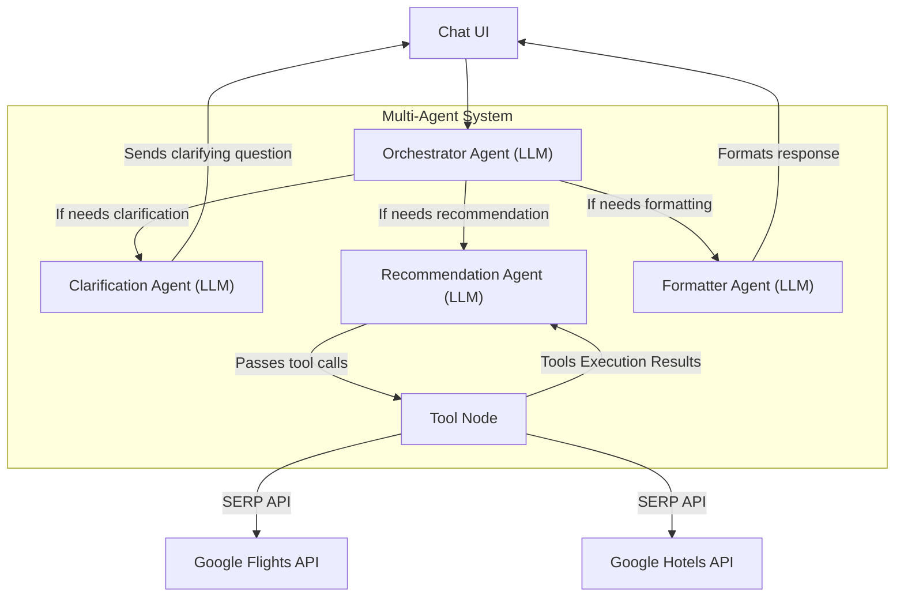

# Smart Travel Planner



## Steps to run
- Create virtual environment
```
uv venv --python 3.12
source .venv/bin/activate
uv sync
```

- Create a .env file with the below keys
```
SERPAPI_API_KEY=
GOOGLE_API_KEY=
LANGCHAIN_API_KEY=
```
