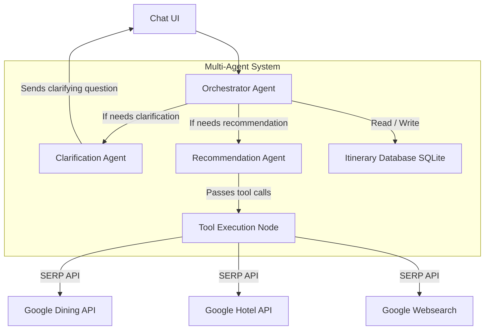

# Smart Travel Planner


```mermaid 
graph TD
    CHAT[Chat UI]
    ORCH_AGENT[Orchestrator Agent]
    CLARIFY_AGENT[Clarification Agent]
    RECOMMEND_AGENT[Recommendation Agent]
    TOOL_NODE[Tool Execution Node]
    GOOGLE_DINING[Google Dining API]
    GOOGLE_HOTEL[Google Hotel API]
    GOOGLE_ACTIVITIES[Google Websearch]

    subgraph Multi-Agent System
        ORCH_AGENT[Orchestrator Agent]
        CLARIFY_AGENT[Clarification Agent]
        RECOMMEND_AGENT[Recommendation Agent]
        TOOL_NODE[Tool Execution Node]
        ITINERARY_DB[Itinerary Database SQLite]
    end

    CHAT --> ORCH_AGENT
    ORCH_AGENT -->|If needs clarification| CLARIFY_AGENT
    ORCH_AGENT -->|If needs recommendation| RECOMMEND_AGENT
    ORCH_AGENT -->|Read / Write| ITINERARY_DB

    RECOMMEND_AGENT -->|Passes tool calls| TOOL_NODE

    TOOL_NODE -->|SERP API| GOOGLE_DINING
    TOOL_NODE -->|SERP API| GOOGLE_HOTEL
    TOOL_NODE -->|SERP API| GOOGLE_ACTIVITIES

    CLARIFY_AGENT -->|Sends clarifying question| CHAT
```

## Steps to run
```
uv venv --python 3.12
source .venv/bin/activate
uv sync
```
