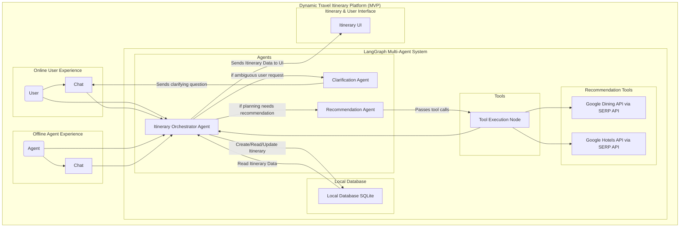

# Smart Travel Planner

```mermaid 
graph TD
    subgraph "Dynamic Travel Itinerary Platform (MVP)"
        subgraph "Online User Experience"
            U(User)
            UC[Chat]
            U --> UC
        end

        subgraph "Offline Agent Experience"
            A(Agent)
            AC[Chat]
            A --> AC
        end

        subgraph "LangGraph Multi-Agent System"
            subgraph "Agents"
                OAG[Itinerary Orchestrator Agent]
                RA[Recommendation Agent]
                CA[Clarification Agent]
            end
            
            subgraph "Tools"
                TE[Tool Execution Node]
            end

            U --> OAG
            UC --> OAG
            A --> OAG
            AC --> OAG
            
            OAG -- "if ambiguous user request" --> CA
            OAG -- "if planning needs recommendation" --> RA
            CA -- "Sends clarifying question" --> UC
            RA -- "Passes tool calls" --> TE
            TE --> OAG
            
            subgraph "Local Database"
                DB[Local Database SQLite]
            end
            
            OAG -- "Create/Read/Update Itinerary" --> DB
            DB -- "Read Itinerary Data" --> OAG

            subgraph "Recommendation Tools"
                GDA[Google Dining API via SERP API]
                GHA[Google Hotels API via SERP API]
            end
            
            TE --> GDA
            TE --> GHA
        end

        subgraph "Itinerary & User Interface"
            UI[Itinerary UI]
        end
        OAG -- "Sends Itinerary Data to UI" --> UI
    end
```