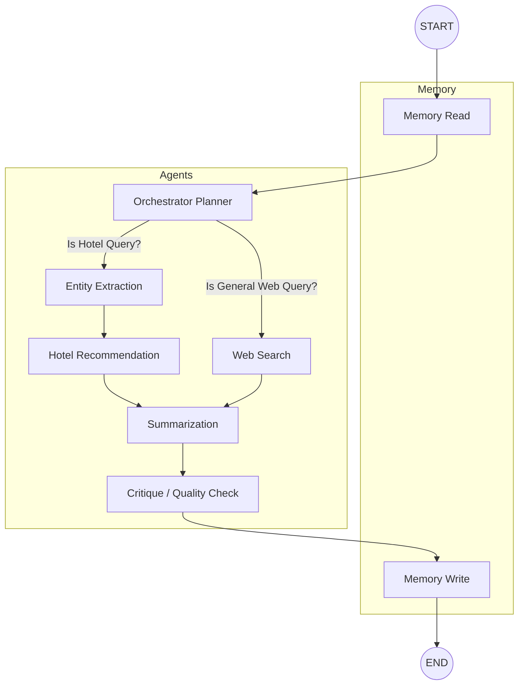

# Smart Travel Planner - Hierarchical Multi-Agent Architecture

This project is a sophisticated AI-powered travel planning companion. It uses LangGraph to coordinate a flexible, multi-agent architecture capable of reasoning about queries, categorizing requests, routing context, invoking search APIs (Tavily & SERP), and verifying responses before delivering them to the user.

## ✨ Features
- **Hierarchical Routing**: Routes "hotel" queries distinctly from "general web search" queries.
- **Entity Extraction**: Uses LLM structured output to pull out cities, dates, and landmarks to feed strictly typed APIs.
- **Quality Critique**: Ensures the final summaries adequately answer the user's initial criteria.
- **Persistent Memory**: Learns user preferences across sessions using Mem0 + local Qdrant vector store.

---

## 🏗️ Architecture Design (LangGraph)

Below is the state graph driving the application's flows:



### Agent Roles
1. **Memory Read Node**: Retrieves relevant user preferences from past sessions before routing. Injects them into the orchestrator and summarize prompts for personalisation.
2. **Orchestrator Planner**: Uses `gemini-2.5-flash` to analyze the query. If the user asks about hotels, it routes to strictly structured entity extraction. If it's general knowledge, it routes to standard web search.
3. **Entity Extraction Node**: Parses location strings, radius, and check-in dates into a strictly typed dictionary (`agents.state.Entities`) via Langchain's `with_structured_output`.
4. **Hotel Recommendation Node**: Passes strictly extracted JSON parameters to the SERP Google Hotels API.
5. **Web Search Node**: Given a broader request, searches the internet via Tavily.
6. **Summarisation Node**: Ingests raw outputs from the Hotel API or Tavily Web Search, converting JSON or text shards into a helpful dialogue. Personalises the response using retrieved user memory.
7. **Critique Node**: Evaluates the summary against the user's initial need. A failed critique (`is_valid=False`) triggers an autonomous 100% confidence feedback signal.
8. **Memory Write Node**: Extracts lasting insights from the conversation and stores them. Processes critique failures as autonomous feedback signals and applies memory decay.

---

## 📂 Code Structure

```
├── agents/
│   ├── graph.py       # The compiled LangGraph definitions
│   ├── nodes.py       # Core node functions utilizing LLMs and Pydantic schemas
│   └── state.py       # TypedDict schemas for internal routing payloads
├── memory/
│   └── mem0_manager.py  # TravelMemoryManager — Mem0 + Qdrant + SQLite signal scores
├── tools/
│   ├── serpapi_tools.py # Wrapper for Google Hotels Search 
│   └── tavily_tools.py  # Wrapper for Tavily's Web Search
├── main.py            # CLI interactive Chat interface
├── pyproject.toml     # `uv` managed dependency file
└── README.md          # Documentation
```

---

---

## 🧠 Memory & Personalisation

The planner learns and remembers user preferences across sessions using [Mem0](https://github.com/mem0ai/mem0) as the memory layer.

### How it works
- **Session start**: `memory_read_node` retrieves relevant past preferences and injects them into the orchestrator and summarize prompts.
- **Session end**: `memory_write_node` extracts lasting insights from the conversation and stores them. A failed critique automatically triggers a feedback update.
- **CLI feedback**: After every response, `main.py` collects a brief reaction. Signals are typed and weighted before being written to memory.

### Local storage (no Docker required)
| Store | Path | Purpose |
|---|---|---|
| Qdrant (embedded) | `./memory_store/` | Vector embeddings of user preferences |
| SQLite | `./memory_store/signal_scores.db` | Confidence scores and implicit hit counts |

### Two signal types
| Signal | Example | Confidence |
|---|---|---|
| **Conversational** | User types "too expensive" | 10% per occurrence — accumulates |
| **Autonomous** | `critique_node` sets `is_valid=False` | 100% — no human needed |

### Score thresholds
| Score | Action |
|---|---|
| > 0.8 | Update memory directly |
| 0.3 – 0.8 | Flag for human-in-the-loop (HITL) review |
| < 0.3 | Accumulate — watch for pattern |
| 0 | Archive (never hard deleted — resurrection possible) |

---

## 🛠 Environmental Setup

This project uses `uv` for lightning-fast dependency management and requires a few API keys to operate its nodes fully:

### 1. Set API Keys
Create a `.env` file at the root of the project:

```bash
# .env

# LLM Orchestrator and Generation
GOOGLE_API_KEY="your_google_gemini_key_here"

# Web Search
TAVILY_API_KEY="your_tavily_key"

# Google Hotel / Utilities
SERPAPI_API_KEY="your_serpapi_key_here"

# Optional: LangSmith Tracing
LANGCHAIN_TRACING_V2=true
LANGCHAIN_API_KEY="your_langsmith_key"
LANGCHAIN_PROJECT="SmartTravelPlanner"
```

### 2. Install Dependencies
Ensure you have [uv](https://docs.astral.sh/uv/) installed. Run:

```bash
uv sync
```

This installs all dependencies including `mem0ai` and `qdrant-client` for the local memory layer.

### 3. Run the application
Run the interactive CLI agent:

```bash
uv run python main.py
```

### 4. Exploring LangSmith Traces
This project now strictly enforces telemetry across all agent nodes via LangSmith's `@traceable` decorators.

By providing the `LANGCHAIN_API_KEY` in the `.env` file, execution payloads will automatically flow into your LangSmith dashboard under the "SmartTravelPlanner" project. 

- Tracing helps debug LLM errors, measure node execution latency, and verify structured Pydantic input schemas in UI.
- Ensure your `LANGCHAIN_TRACING_V2=true` value is active to retain logs!
